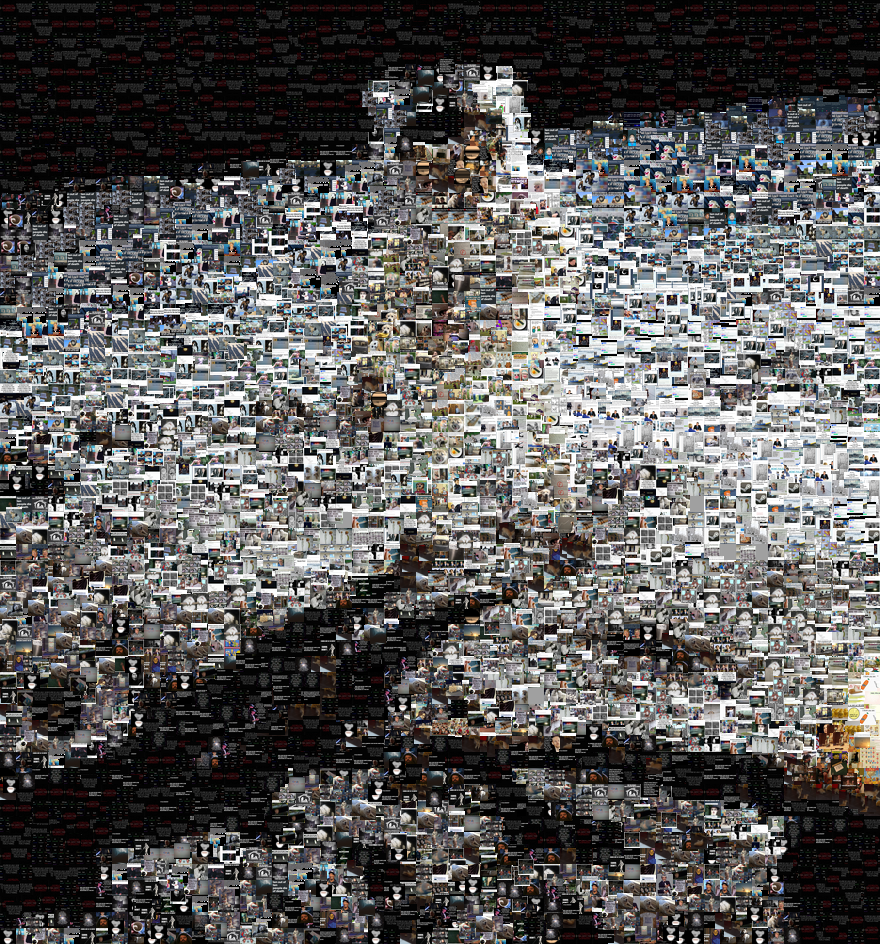

# PyImgMosaic

Reproduce images from smaller image tiles

# Background

This program makes pictures from lots of other smaller pictures (kind of like those posters that you see in various places.)

Simple overview:  
 o User uploads cache of images to be converted into small tiles to the `img_src` directory.  
 o User selects an image to reproduce and determines a tile size (i.e. 32px by 32 px)  
 o User runs `python PyImgMosaic.py -f inputfile -s 32` where `32` is your desired tile size.  
    - Python uses the helper bash script `scaler.sh`, which in turn invokes ImageMagic's convert tool to build a pool of scaled down images.  
    -  These images remain available as long as they aren't deleted.  The script will not repeat effort to shrink images if the output files already exist.  
 o The Python program first reads this cache and determines the average RGB value of the image, and saves it in a Dictionary.  
 o The input file is read in tile sized blocks.  The average value of the block is used to find the closest match in the dictionary.  This found tile is placed in the correct spot of the output image.  
 o Once tiles are used, they are set aside until we either run out of tiles, or an error threshold value is exceeded (i.e. none of the matches are close.)  When this happens, all previously used tiles become available again.  
 o A certain percentage of tiles are placed randomly (not grid aligned) based on default or user settings.  
 o The program writes the output image to disk and displays it to the user.  

# Limits

This is not optimized in any way for speed.  Even with this implementation, I was able to convert a 10000x10000 pixel image to 64x64 tiles in about a minute.  

For best results, build a large cache of source images to use for better color matching.  Imgur dumps work well.  

The default threshold for error testing was determined by playing with the output for 10 minutes.  You may have to search for an optimal value.  

There is room for future improvement in how tiles are selected and recycled.

